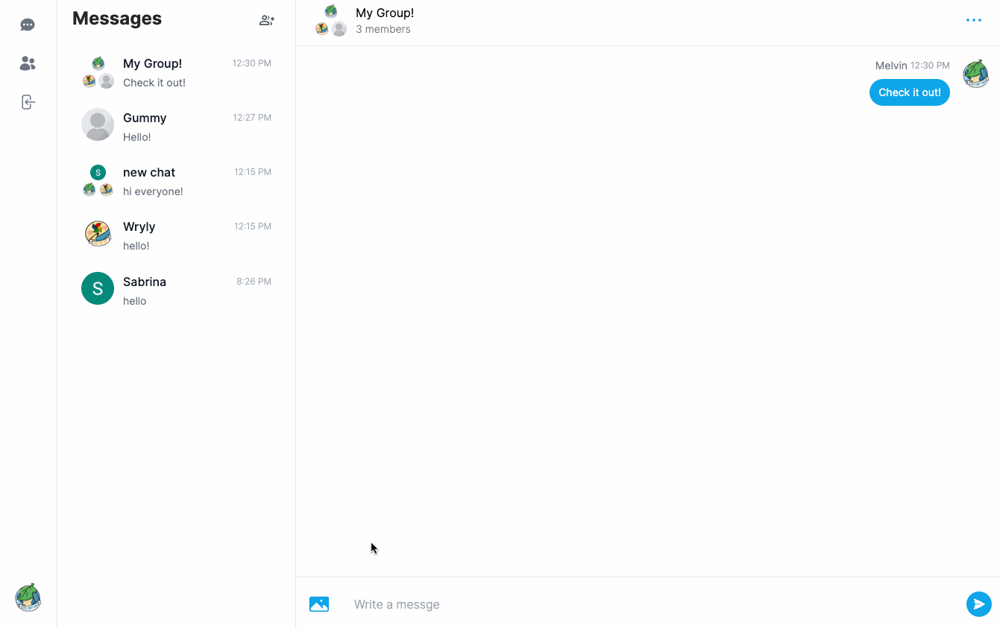
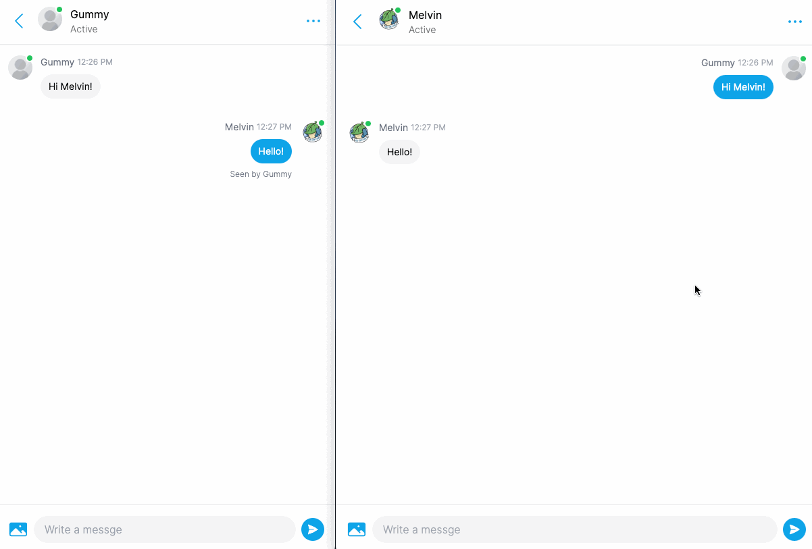

# Lil Messenger Clone

A full-stack, real-time Messenger clone. Uses Next, React, Tailwind, Prisma, MongoDB, NextAuth, Pusher, and more. Responsive for desktop, tablet, and mobile views. Hosted [here](https://lil-messenger-clone.vercel.app/) on Vercel.

## Main Features
- Real-time messaging using Pusher
- Message notifications and read-receipts
- One-on-one and group chat functionality
- Create, manage, and delete conversations
- Active/offline user status
- Custom display names and avatars (Cloudinary)
- Image attachments (Cloudinary)
- Server error handling (Hot Toast)
- Authentation with NextAuth - log in with email, Github, or Google
- Data persisted through MongoDB database using Prisma

## Showcase
** NOTE: Some display/colour issues with the .gif recordings. Sorry! Take a look at the live site for the best experience.
### New user registration

### Unread messages, read receipts

### Profile customization

### Group chats

### Image attachments

### Live updates

### Active status

## Packages
- `axios`
- `bcrypt`
- `clsx`
- `lodash`
- `next-auth`
- `next-cloudinary`
- `pusher`
- `react-hot-toast`
- `react-icons`
